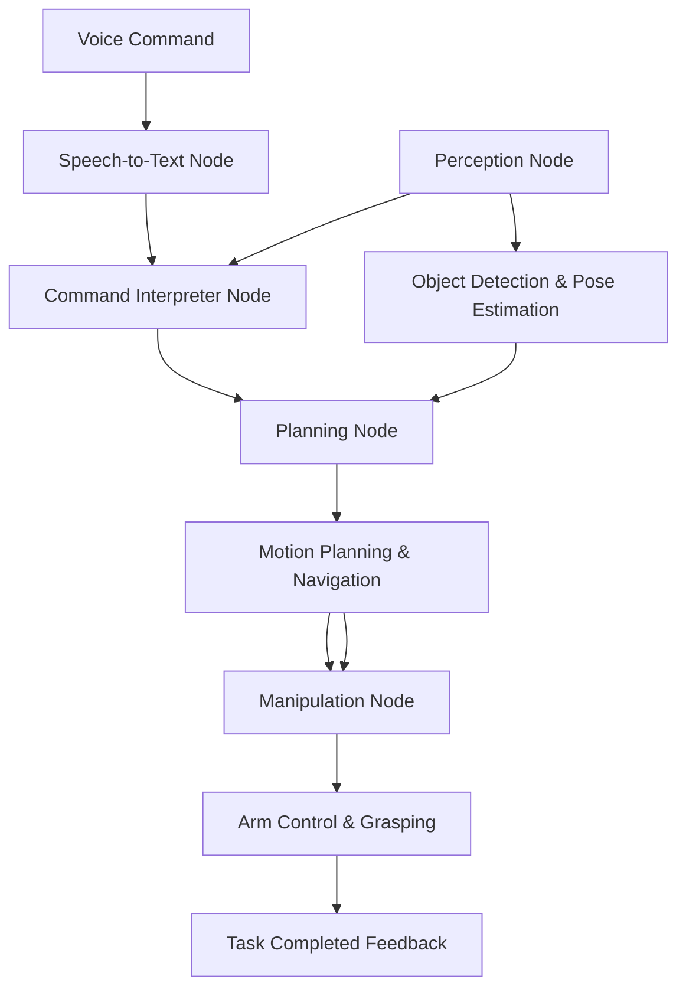

# Capstone Project: The Autonomous Humanoid

## Introduction and Motivation

Welcome to the culminating project of the Physical AI & Humanoid Robotics textbook! This capstone project integrates all the concepts you've learned in previous modules into a single, impressive end-to-end autonomous system. You'll build a complete autonomous humanoid robot that can receive natural language voice commands and execute complex manipulation tasks in simulation.

This project demonstrates the full Physical AI pipeline in action: perception, reasoning, planning, and action. By the end of this module, you'll have created a system that can understand human instructions, perceive its environment, plan actions, and execute them autonomously.

## Project Overview Diagram



## Prerequisites Review

Before starting this capstone project, you should have completed:

- Module 1: ROS 2 for Physical AI
- Module 2: Digital Twin Simulation
- Module 3: Vision-Language-Action Systems
- Module 4: Advanced Digital Twin Synchronization

You should be familiar with:
- ROS 2 concepts (nodes, topics, services, actions)
- Simulation environments (Isaac Sim or Gazebo)
- Computer vision techniques
- Vision-Language-Action models

## Required Tools and Environment (Free-Tier Only)

- **NVIDIA Isaac Sim** (free for developers) or **Gazebo** with ROS 2
- **ROS 2 Humble** or **Iron**
- **Python 3.10+**
- **Whisper.cpp** or **Hugging Face Whisper** (local/offline)
- **OpenVLA** or similar open-source VLA model (or LLM fallback with vision prompts)
- **MoveIt 2** for motion planning
- **Optional**: RViz for visualization

## Step-by-Step Implementation Guide

### Phase 1: Setup the Simulation Environment

1. Install your chosen simulation environment (Isaac Sim or Gazebo)
2. Set up a humanoid robot model in the simulation
3. Create a world with a table, objects (red ball), and boxes (blue box)
4. Configure your ROS 2 workspace and install dependencies

```bash
# Install required dependencies
sudo apt update
sudo apt install ros-humble-moveit
pip install openvla whisper-speech
```

### Phase 2: Implement Speech-to-Text Node

Create `src/speech_to_text_node.py`:

```python
#!/usr/bin/env python3

import rclpy
from rclpy.node import Node
from std_msgs.msg import String
import speech_recognition as sr

class SpeechToTextNode(Node):
    def __init__(self):
        super().__init__('speech_to_text_node')
        self.publisher = self.create_publisher(String, 'voice_command', 10)
        self.recognizer = sr.Recognizer()
        self.microphone = sr.Microphone()

        # Start listening for voice commands
        self.timer = self.create_timer(1.0, self.listen_for_command)

    def listen_for_command(self):
        try:
            with self.microphone as source:
                self.recognizer.adjust_for_ambient_noise(source)
                audio = self.recognizer.listen(source, timeout=5.0)

            # Convert speech to text using Whisper
            command_text = self.recognizer.recognize_whisper(audio, model="base")

            # Publish the recognized command
            msg = String()
            msg.data = command_text
            self.publisher.publish(msg)
            self.get_logger().info(f'Published command: {command_text}')

        except sr.WaitTimeoutError:
            self.get_logger().info('Listening for voice command...')
        except sr.UnknownValueError:
            self.get_logger().info('Could not understand audio')
        except Exception as e:
            self.get_logger().error(f'Error in speech recognition: {e}')

def main(args=None):
    rclpy.init(args=args)
    node = SpeechToTextNode()

    try:
        rclpy.spin(node)
    except KeyboardInterrupt:
        pass
    finally:
        node.destroy_node()
        rclpy.shutdown()

if __name__ == '__main__':
    main()
```

### Phase 3: Build Perception Pipeline

Create `src/perception_node.py`:

```python
#!/usr/bin/env python3

import rclpy
from rclpy.node import Node
from sensor_msgs.msg import Image
from geometry_msgs.msg import Point
from std_msgs.msg import String
import cv2
import numpy as np

class PerceptionNode(Node):
    def __init__(self):
        super().__init__('perception_node')
        self.image_sub = self.create_subscription(
            Image, 'camera/image_raw', self.image_callback, 10)
        self.object_pub = self.create_publisher(String, 'detected_objects', 10)
        self.position_pub = self.create_publisher(Point, 'object_positions', 10)

        # Initialize object detection model
        self.get_logger().info('Perception node initialized')

    def image_callback(self, msg):
        # Convert ROS image to OpenCV format
        # Process image to detect objects
        # Publish detected objects and their positions
        pass

def main(args=None):
    rclpy.init(args=args)
    node = PerceptionNode()

    try:
        rclpy.spin(node)
    except KeyboardInterrupt:
        pass
    finally:
        node.destroy_node()
        rclpy.shutdown()

if __name__ == '__main__':
    main()
```

### Phase 4: Create Command Interpreter

Create `src/command_interpreter_node.py`:

```python
#!/usr/bin/env python3

import rclpy
from rclpy.node import Node
from std_msgs.msg import String
import json

class CommandInterpreterNode(Node):
    def __init__(self):
        super().__init__('command_interpreter_node')
        self.command_sub = self.create_subscription(
            String, 'voice_command', self.command_callback, 10)
        self.task_pub = self.create_publisher(String, 'task_plan', 10)

        # Initialize VLA or LLM model
        self.get_logger().info('Command interpreter node initialized')

    def command_callback(self, msg):
        # Process natural language command using VLA/LLM
        # Generate task plan based on command and perceived objects
        command = msg.data
        self.get_logger().info(f'Processing command: {command}')

        # Example: "Pick up the red ball on the table and place it in the blue box"
        # Parse command and generate task plan
        task_plan = self.parse_command(command)

        # Publish task plan
        task_msg = String()
        task_msg.data = json.dumps(task_plan)
        self.task_pub.publish(task_msg)

    def parse_command(self, command):
        # Implement command parsing logic
        # This would use VLA model or LLM to understand the command
        # and generate a structured task plan
        pass

def main(args=None):
    rclpy.init(args=args)
    node = CommandInterpreterNode()

    try:
        rclpy.spin(node)
    except KeyboardInterrupt:
        pass
    finally:
        node.destroy_node()
        rclpy.shutdown()

if __name__ == '__main__':
    main()
```

### Phase 5: Integrate Motion Planning

Create `src/planning_node.py`:

```python
#!/usr/bin/env python3

import rclpy
from rclpy.node import Node
from std_msgs.msg import String
from geometry_msgs.msg import Pose
import json

class PlanningNode(Node):
    def __init__(self):
        super().__init__('planning_node')
        self.task_sub = self.create_subscription(
            String, 'task_plan', self.task_callback, 10)
        self.plan_pub = self.create_publisher(String, 'motion_plan', 10)

        # Initialize MoveIt 2 planning interface
        self.get_logger().info('Planning node initialized')

    def task_callback(self, msg):
        # Receive task plan from command interpreter
        # Generate motion plan using MoveIt 2
        task_plan = json.loads(msg.data)
        self.get_logger().info(f'Generating motion plan for: {task_plan}')

        # Implement motion planning logic
        motion_plan = self.generate_motion_plan(task_plan)

        # Publish motion plan
        plan_msg = String()
        plan_msg.data = json.dumps(motion_plan)
        self.plan_pub.publish(plan_msg)

    def generate_motion_plan(self, task_plan):
        # Use MoveIt 2 to plan navigation and manipulation paths
        # Avoid obstacles and plan safe trajectories
        pass

def main(args=None):
    rclpy.init(args=args)
    node = PlanningNode()

    try:
        rclpy.spin(node)
    except KeyboardInterrupt:
        pass
    finally:
        node.destroy_node()
        rclpy.shutdown()

if __name__ == '__main__':
    main()
```

### Phase 6: Implement Grasping and Manipulation

Create `src/manipulation_node.py`:

```python
#!/usr/bin/env python3

import rclpy
from rclpy.node import Node
from std_msgs.msg import String
from geometry_msgs.msg import Pose
import json

class ManipulationNode(Node):
    def __init__(self):
        super().__init__('manipulation_node')
        self.plan_sub = self.create_subscription(
            String, 'motion_plan', self.plan_callback, 10)
        self.feedback_pub = self.create_publisher(String, 'execution_feedback', 10)

        # Initialize humanoid arm controllers
        self.get_logger().info('Manipulation node initialized')

    def plan_callback(self, msg):
        # Execute manipulation tasks based on motion plan
        motion_plan = json.loads(msg.data)
        self.get_logger().info(f'Executing manipulation plan: {motion_plan}')

        # Implement manipulation execution logic
        success = self.execute_manipulation(motion_plan)

        # Publish execution feedback
        feedback_msg = String()
        feedback_msg.data = f"Manipulation {'successful' if success else 'failed'}"
        self.feedback_pub.publish(feedback_msg)

    def execute_manipulation(self, motion_plan):
        # Execute arm movements and grasping actions
        # Handle error recovery if grasping fails
        pass

def main(args=None):
    rclpy.init(args=args)
    node = ManipulationNode()

    try:
        rclpy.spin(node)
    except KeyboardInterrupt:
        pass
    finally:
        node.destroy_node()
        rclpy.shutdown()

if __name__ == '__main__':
    main()
```

### Phase 7: Orchestrate All Nodes

Create `src/main_orchestrator.py`:

```python
#!/usr/bin/env python3

import rclpy
from rclpy.node import Node
from std_msgs.msg import String

class MainOrchestrator(Node):
    def __init__(self):
        super().__init__('main_orchestrator')
        self.feedback_sub = self.create_subscription(
            String, 'execution_feedback', self.feedback_callback, 10)

        self.get_logger().info('Main orchestrator initialized')

    def feedback_callback(self, msg):
        # Monitor execution feedback from all nodes
        self.get_logger().info(f'System feedback: {msg.data}')

        # Implement state management and error handling
        if "successful" in msg.data:
            # Task completed, ready for next command
            pass
        else:
            # Handle error/recovery
            pass

def main(args=None):
    rclpy.init(args=args)
    node = MainOrchestrator()

    try:
        rclpy.spin(node)
    except KeyboardInterrupt:
        pass
    finally:
        node.destroy_node()
        rclpy.shutdown()

if __name__ == '__main__':
    main()
```

### Phase 8: Create Launch File

Create `launch/autonomous_humanoid.launch.py`:

```python
from launch import LaunchDescription
from launch_ros.actions import Node
from ament_index_python.packages import get_package_share_directory
import os

def generate_launch_description():
    return LaunchDescription([
        # Speech-to-text node
        Node(
            package='capstone_project',
            executable='speech_to_text_node',
            name='speech_to_text_node',
            output='screen'
        ),

        # Command interpreter node
        Node(
            package='capstone_project',
            executable='command_interpreter_node',
            name='command_interpreter_node',
            output='screen'
        ),

        # Perception node
        Node(
            package='capstone_project',
            executable='perception_node',
            name='perception_node',
            output='screen'
        ),

        # Planning node
        Node(
            package='capstone_project',
            executable='planning_node',
            name='planning_node',
            output='screen'
        ),

        # Manipulation node
        Node(
            package='capstone_project',
            executable='manipulation_node',
            name='manipulation_node',
            output='screen'
        ),

        # Main orchestrator
        Node(
            package='capstone_project',
            executable='main_orchestrator',
            name='main_orchestrator',
            output='screen'
        ),
    ])
```

## Common Pitfalls and Debugging Tips

1. **Audio Quality Issues**: Ensure your microphone is properly configured and in a quiet environment for accurate speech recognition.

2. **Object Detection Failures**: Verify that objects in your simulation have proper visual properties (textures, colors) that can be detected by your computer vision algorithms.

3. **Motion Planning Failures**: Check that collision objects are properly defined in your MoveIt configuration and that the robot has enough space to maneuver.

4. **Timing Issues**: Coordinate the timing between nodes using appropriate ROS 2 QoS settings and message synchronization.

5. **Memory Usage**: Monitor memory usage when running large models like VLA or LLMs, especially on systems with limited resources.

## Full Source Code

The complete source code for this project is available in the [GitHub repository](https://github.com/your-repo/capstone-project). The repository includes:

- All node implementations
- Launch files
- Configuration files
- Simulation world files
- Example scripts

## Demo Video

<iframe width="560" height="315" src="https://www.youtube.com/embed/your-demo-video" title="YouTube video player" frameborder="0" allow="accelerometer; autoplay; clipboard-write; encrypted-media; gyroscope; picture-in-picture" allowfullscreen></iframe>

## Bonus Challenges

1. **Multi-step commands**: Implement support for complex commands like "Pick up the red ball, then place it on the shelf"

2. **Dynamic obstacles**: Add moving obstacles that the robot must navigate around

3. **Urdu voice command support**: Extend the speech recognition to support Urdu language commands

4. **RAG-powered knowledge**: Implement Retrieval-Augmented Generation for object property knowledge (e.g., "The red ball is made of rubber")

## Submission Guidelines for Hackathon

If participating in the hackathon, please ensure your submission includes:

1. A working ROS 2 package that completes the task in simulation
2. A 2-3 minute demo video showing voice command → successful manipulation
3. A README with setup instructions and design decisions
4. Code comments and documentation
5. Any custom simulation environments or models you created

## Summary

The Capstone Project: The Autonomous Humanoid represents the culmination of your learning journey through the Physical AI & Humanoid Robotics textbook. You've successfully integrated ROS 2, Digital Twin Simulation, and Vision-Language-Action Systems into a single, impressive end-to-end autonomous system.

This project demonstrates the full Physical AI pipeline in action and provides a foundation for further exploration in humanoid robotics and autonomous systems. Congratulations on completing this comprehensive capstone project!