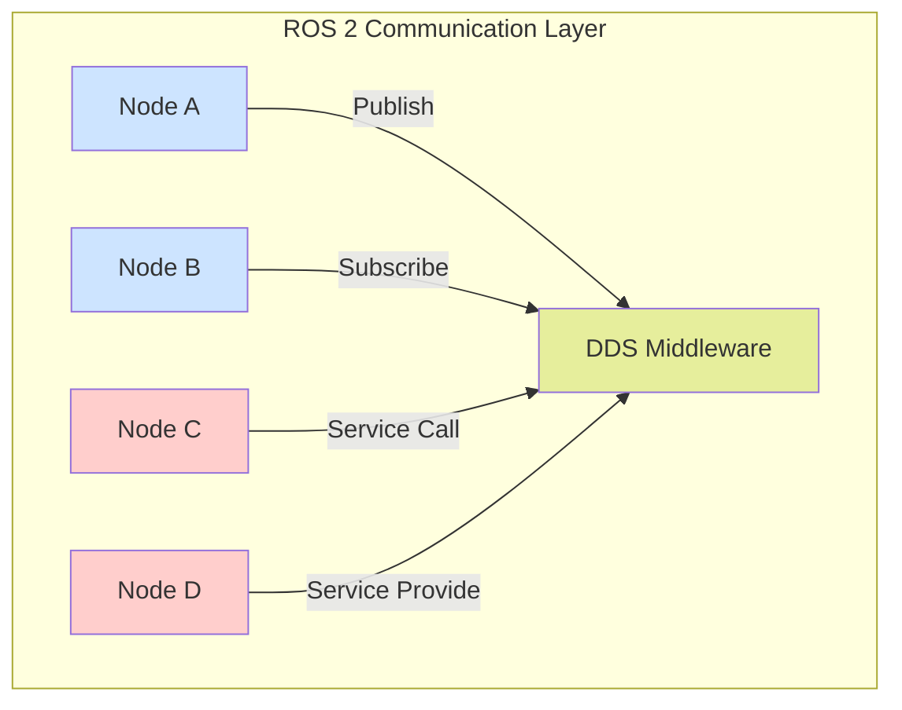

# ROS 2 Communication Model

## Overview

The ROS 2 communication model is built on the Data Distribution Service (DDS) standard, providing a flexible, distributed communication infrastructure for robotic applications. Understanding this model is crucial for developing effective humanoid robotics systems.

This module covers the fundamental communication primitives in ROS 2: nodes, topics, services, and actions. These building blocks enable the creation of complex, distributed robotic systems where different components can communicate seamlessly.

## Core Communication Concepts

### Nodes
Nodes are the fundamental execution units in ROS 2. Each node is a process that performs computation and communicates with other nodes through the ROS 2 communication infrastructure.

### Topics and Publishers/Subscribers
Topics enable asynchronous, many-to-many communication through a publish-subscribe pattern. Publishers send messages to topics, and subscribers receive messages from topics.

### Services and Clients
Services enable synchronous, request-response communication between nodes. A client sends a request and waits for a response from a service.

### Actions
Actions provide goal-oriented communication with feedback and status updates, ideal for long-running tasks.

## Communication Architecture

*Above: ROS 2 communication architecture showing different communication patterns*

## When to Use Each Communication Pattern

- **Topics**: Sensor data, continuous state updates, broadcast information
- **Services**: One-time requests, configuration changes, blocking operations
- **Actions**: Long-running tasks with feedback (navigation, manipulation)

## Quality of Service (QoS) Settings

Different communication patterns require different QoS settings based on the requirements:

- **Reliability**: Reliable vs. best-effort delivery
- **Durability**: Transient local vs. volatile data
- **History**: Keep-all vs. keep-last policies

In the following sections, we'll explore each communication primitive in detail with practical examples for humanoid robotics applications.