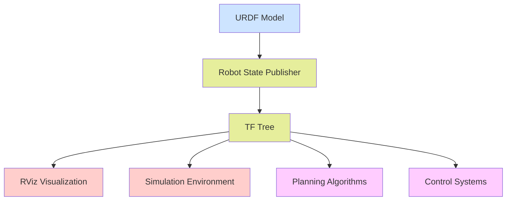

# Robot Structure with URDF

## Introduction to Robot Structure Definition

URDF (Unified Robot Description Format) is an XML-based format used in ROS to describe robot models. For humanoid robots, URDF is crucial as it defines the physical structure, kinematic relationships, and visual/inertial properties of the robot.

This module covers everything you need to know about defining robot structure using URDF for humanoid robots, with special attention to simulation readiness and practical implementation.

## What is URDF?

URDF stands for Unified Robot Description Format. It's an XML format that allows you to describe your robot in terms of:

- **Links**: Rigid parts of the robot (like a arm segment, chassis, etc.)
- **Joints**: Connections between links that allow motion
- **Visual**: How the robot appears in visualizers
- **Collision**: How the robot interacts with the physical world
- **Inertial**: Mass, center of mass, and inertia properties for physics simulation

## URDF in the Context of Humanoid Robots

Humanoid robots present unique challenges in URDF definition:

- **Many degrees of freedom**: Typically 20+ joints requiring careful kinematic chain design
- **Balance requirements**: Proper center of mass and inertial properties are critical
- **Symmetry**: Often have symmetric limbs that can benefit from macros/templates
- **Complex geometries**: Curved surfaces and complex shapes for anthropomorphic design

## Basic URDF Structure

```xml
<?xml version="1.0"?>
<robot name="simple_humanoid">
  <!-- Links -->
  <link name="base_link">
    <visual>
      <geometry>
        <box size="0.5 0.5 0.5"/>
      </geometry>
    </visual>
    <collision>
      <geometry>
        <box size="0.5 0.5 0.5"/>
      </geometry>
    </collision>
    <inertial>
      <mass value="1"/>
      <origin xyz="0 0 0"/>
      <inertia ixx="0.083" ixy="0" ixz="0" iyy="0.083" iyz="0" izz="0.083"/>
    </inertial>
  </link>

  <!-- Joints -->
  <joint name="base_to_upper_body" type="fixed">
    <parent link="base_link"/>
    <child link="upper_body"/>
    <origin xyz="0 0 0.25"/>
  </joint>

  <link name="upper_body">
    <visual>
      <geometry>
        <box size="0.3 0.3 0.6"/>
      </geometry>
    </visual>
    <collision>
      <geometry>
        <box size="0.3 0.3 0.6"/>
      </geometry>
    </collision>
    <inertial>
      <mass value="2"/>
      <origin xyz="0 0 0"/>
      <inertia ixx="0.15" ixy="0" ixz="0" iyy="0.125" iyz="0" izz="0.075"/>
    </inertial>
  </link>
</robot>
```

## URDF for Humanoid Robotics Architecture



*Above: How URDF integrates with the ROS 2 ecosystem for humanoid robotics*

## Key Components of Humanoid URDF

### Links
Links represent rigid bodies in the robot. For humanoid robots, common links include:
- Torso/trunk
- Head
- Upper and lower arms
- Upper and lower legs
- Hands and feet

### Joints
Joints define how links connect and move relative to each other:
- **Revolute**: Rotational joints with limits (like elbows, knees)
- **Continuous**: Rotational joints without limits (like shoulders)
- **Prismatic**: Linear joints (rare in humanoid robots)
- **Fixed**: No movement (for attaching sensors or static parts)

### Materials and Visuals
Visual properties define how the robot appears in simulation and visualization tools.

## Simulation Readiness

For humanoid robots to work properly in simulation environments like Gazebo or Ignition, your URDF must include:

- Accurate inertial properties
- Proper collision geometries
- Correct joint limits and dynamics
- Gazebo-specific plugins if needed

In the following sections, we'll explore each aspect of URDF in detail with practical examples for humanoid robots.