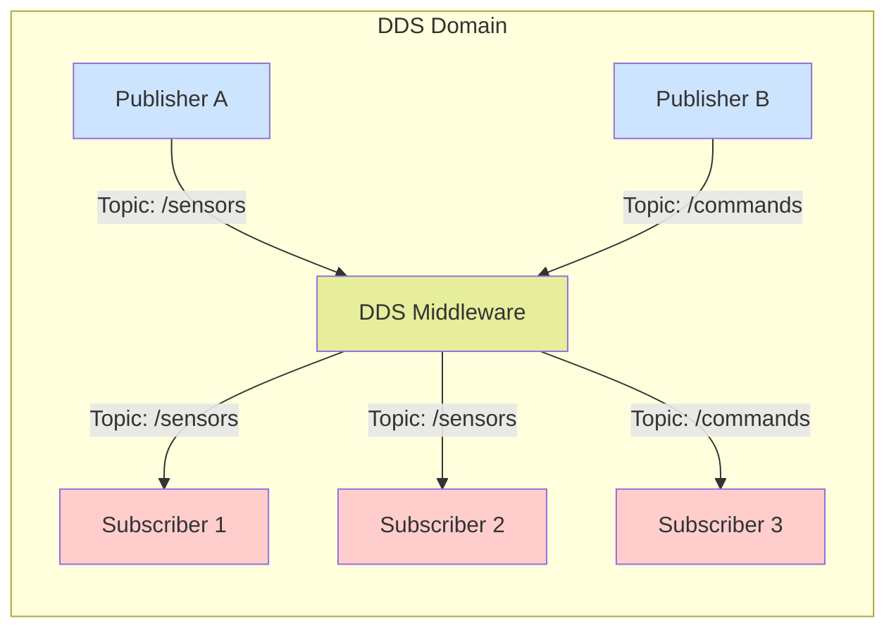

# DDS (Data Distribution Service) Concepts

## What is DDS?

DDS (Data Distribution Service) is an OMG (Object Management Group) standard for real-time, distributed data exchange. In ROS 2, DDS serves as the underlying communication middleware that enables nodes to communicate with each other, whether they're running on the same machine or distributed across a network.

For humanoid robotics, DDS provides the foundation for reliable, real-time communication between different subsystems of the robot.

## Core DDS Concepts

### Data-Centric Architecture

Unlike traditional request-response systems, DDS uses a data-centric approach:

- **Data availability**: Data is available to all interested parties automatically
- **Decoupling**: Publishers and subscribers don't need to know about each other
- **Automatic discovery**: New publishers and subscribers are discovered automatically
- **Quality of Service (QoS)**: Different data streams can have different reliability and timing requirements

### DDS Entities

- **Domain**: A communication plane that isolates DDS applications from each other
- **Participant**: An application participating in a DDS domain
- **Topic**: A named data object that represents a piece of information
- **Publisher**: An entity that publishes data to topics
- **Subscriber**: An entity that subscribes to topics to receive data
- **DataWriter**: An entity that writes data to a specific topic
- **DataReader**: An entity that reads data from a specific topic

## QoS (Quality of Service) Profiles

QoS profiles allow you to specify how data should be handled in terms of reliability, durability, and other characteristics:

### Reliability Policy
- **Reliable**: All messages are delivered (like TCP)
- **Best Effort**: Messages may be lost (like UDP)

For humanoid robots, sensor data might use best-effort while critical control commands use reliable delivery.

### Durability Policy
- **Transient Local**: Late-joining subscribers receive previously published data
- **Volatile**: Late-joining subscribers only receive future data

For humanoid robots, static configuration data might use transient local while dynamic sensor data uses volatile.

### History Policy
- **Keep Last**: Only the most recent samples are kept
- **Keep All**: All samples are kept (subject to resource limits)

### Deadline and Lifespan
- **Deadline**: How often data is expected to be published
- **Lifespan**: How long data remains valid after publication

## DDS in ROS 2 Context

In ROS 2, DDS is abstracted away, but understanding it is crucial for humanoid robotics:

```python
# Example of setting QoS in ROS 2
from rclpy.qos import QoSProfile, ReliabilityPolicy, DurabilityPolicy

# For critical control commands
control_qos = QoSProfile(
    depth=10,
    reliability=ReliabilityPolicy.RELIABLE,
    durability=DurabilityPolicy.VOLATILE
)

# For sensor data that can tolerate some loss
sensor_qos = QoSProfile(
    depth=5,
    reliability=ReliabilityPolicy.BEST_EFFORT,
    durability=DurabilityPolicy.VOLATILE
)
```

## Benefits for Humanoid Robotics

DDS provides several advantages for humanoid robotics:

- **Scalability**: Can handle multiple sensors and actuators efficiently
- **Real-time performance**: Predictable timing characteristics
- **Network transparency**: Same code works locally or distributed
- **Language interoperability**: Different parts can be written in different languages
- **Built-in discovery**: New components can join the system automatically

## DDS Communication Pattern Diagram



*Above: DDS communication pattern showing publishers and subscribers communicating through DDS middleware*

## Common Patterns in Humanoid Robotics

### Sensor Fusion Pattern
Multiple sensors publish to the same topic, and fusion algorithms subscribe to get a complete picture.

### Control Hierarchy Pattern
High-level planners publish commands, low-level controllers subscribe and execute them, with feedback flowing back.

### Multi-Robot Coordination
Different robots can share information through DDS across network boundaries.

## Troubleshooting Common Issues

- **Discovery problems**: Ensure all nodes are on the same DDS domain ID
- **Performance issues**: Tune QoS settings based on data characteristics
- **Network issues**: DDS can work over various transports (UDP, TCP, shared memory)