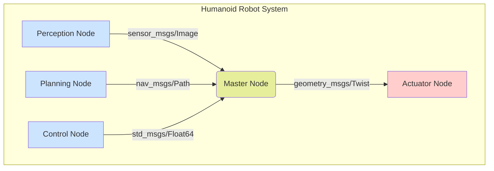

# Introduction to ROS 2 for Humanoid Robotics

## What is ROS 2?

ROS 2 (Robot Operating System 2) is not an operating system, but rather a flexible framework for writing robot software. It's a collection of tools, libraries, and conventions that aim to simplify the task of creating complex and robust robot behavior across a wide variety of robot platforms.

For humanoid robotics specifically, ROS 2 serves as the "nervous system" of the robot, connecting various sensors, actuators, and computational modules through a distributed communication infrastructure.

## Why ROS 2 Matters for Humanoid Robots

Humanoid robots present unique challenges that make ROS 2 particularly valuable:

- **Complex sensor integration**: Multiple cameras, IMUs, force/torque sensors, and other sensory systems need to communicate seamlessly
- **Distributed processing**: Different computational units handling vision, control, planning, and other tasks need to coordinate effectively
- **Real-time requirements**: Humanoid robots need to maintain balance and respond to environmental changes in real-time
- **Modularity**: Different research teams or subsystems need to integrate without tight coupling

## Key Improvements in ROS 2 vs ROS 1

ROS 2 addresses several limitations of the original ROS:

- **Real-time support**: Better timing guarantees for critical robot functions
- **Multi-robot systems**: Native support for multiple robots working together
- **Security**: Built-in security features for safe robot operation
- **Official Windows support**: No longer Linux-only
- **Standardized middleware**: Uses DDS (Data Distribution Service) for communication

## Core Concepts Overview

In this module, you'll learn about:

- **DDS (Data Distribution Service)**: The communication middleware that powers ROS 2
- **Nodes, Topics, Services**: The fundamental building blocks of ROS 2 systems
- **Packages and Workspaces**: How ROS 2 code is organized
- **Launch files**: How to start multiple nodes together
- **URDF (Unified Robot Description Format)**: How robots are described in ROS 2

## Getting Started with ROS 2

Before diving deeper, make sure you understand the basic terminology:

- **Node**: A process that performs computation
- **Topic**: A named bus over which nodes exchange messages
- **Message**: A data structure that is sent between nodes
- **Service**: A synchronous request/response communication pattern

## ROS 2 Architecture Diagram

*Above: Simplified ROS 2 architecture showing nodes communicating through the ROS 2 graph (represented by the Master Node)*

In the next sections, we'll explore each of these concepts in detail with practical examples relevant to humanoid robotics.