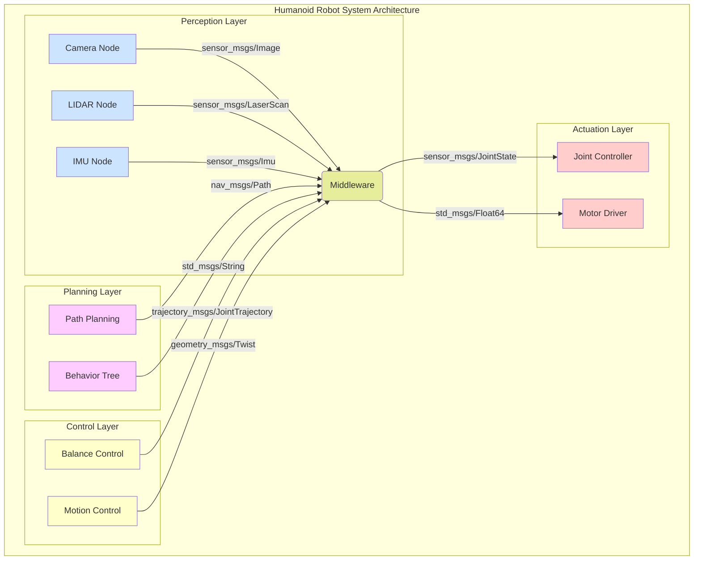

# Why ROS 2 Matters for Humanoid Robotics

## The Challenge of Humanoid Robotics

Humanoid robots represent one of the most complex challenges in robotics, requiring the coordination of numerous subsystems including perception, planning, control, and interaction. Traditional approaches to robot software architecture often struggle with the complexity and real-time requirements of humanoid systems.

ROS 2 addresses these challenges with a distributed, modular architecture that scales from single robots to multi-robot systems.

## Key Requirements for Humanoid Robots

### Real-Time Performance
Humanoid robots must maintain balance and respond to environmental changes within strict timing constraints. ROS 2's DDS-based architecture provides predictable timing characteristics essential for:

- **Balance control**: Maintaining stability at 100Hz or higher
- **Sensor processing**: Handling camera, LIDAR, and IMU data in real-time
- **Collision avoidance**: Reacting to unexpected obstacles instantly

### Distributed Architecture
Humanoid robots typically have multiple computational units:
- **On-board computers**: For high-level planning and perception
- **Real-time controllers**: For motor control and balance
- **Specialized processors**: For vision, audio, or other sensor processing

ROS 2's network-transparent communication allows these units to work together seamlessly.

### Safety and Security
Humanoid robots operate in human environments, requiring robust safety mechanisms:
- **Security**: Authentication and encryption for safe operation
- **Isolation**: Critical systems separated from non-critical ones
- **Fail-safes**: Graceful degradation when components fail

ROS 2 includes built-in security features essential for humanoid applications.

## Advantages of ROS 2 for Humanoid Robotics

### 1. Scalable Communication
```python
# Example: Multi-level control hierarchy
# High-level: Planning (1-10 Hz)
# Mid-level: Trajectory generation (50-100 Hz)
# Low-level: Motor control (1000+ Hz)
```

ROS 2 can handle this multi-rate communication efficiently with appropriate QoS settings.

### 2. Language Interoperability
Different parts of humanoid robots may be best implemented in different languages:
- **Python**: For high-level planning and AI
- **C++**: For real-time control and performance-critical code
- **Other languages**: For specialized libraries or legacy code

### 3. Standardized Interfaces
ROS 2 provides standard message types and service definitions that facilitate:
- **Code reuse**: Components developed for one robot can be used on others
- **Integration**: Third-party sensors and actuators have standardized interfaces
- **Simulation**: Same code runs in simulation and on real robots

### 4. Multi-Robot Coordination
Humanoid robots increasingly work in teams or alongside other robots:
- **Shared perception**: Multiple robots share sensor data
- **Coordinated action**: Synchronized movements and behaviors
- **Load balancing**: Distributed computation across robot teams

## Specific Use Cases in Humanoid Robotics

### Walking and Balance Control
```bash
# Example ROS 2 topics for humanoid balance
/joint_states          # Current joint positions, velocities, efforts
/imu/data             # Inertial measurement unit data
/foot_pressure        # Pressure sensors in feet
/center_of_mass       # Desired and actual center of mass
```

### Humanoid Robot Architecture Diagram



*Above: Architecture of a typical humanoid robot system using ROS 2*

### Perception and Navigation
- **SLAM**: Simultaneous localization and mapping
- **Object recognition**: Identifying and tracking objects
- **Human-robot interaction**: Voice, gesture, and facial recognition

### Humanoid-Specific Challenges
- **High-DOF control**: Managing 20+ degrees of freedom
- **Dynamic balance**: Maintaining stability during movement
- **Compliant control**: Safe interaction with humans and environment

## Comparison with Alternatives

| Aspect | ROS 2 | Proprietary Systems | Custom Solutions |
|--------|-------|-------------------|------------------|
| Community | Large, active | Limited | None |
| Cost | Free | Expensive | Development time |
| Flexibility | High | Moderate | High |
| Safety Features | Built-in | Varies | Custom work |
| Multi-robot | Native | Limited | Custom work |

## Getting Started with ROS 2 for Humanoid Projects

### Prerequisites
- Understanding of basic robotics concepts
- Programming experience in Python or C++
- Familiarity with Linux command line

### Recommended Learning Path
1. Master basic ROS 2 concepts (nodes, topics, services)
2. Learn DDS and QoS concepts for performance
3. Study humanoid-specific packages and tools
4. Practice with simulation environments
5. Apply to real hardware

## Best Practices for Humanoid ROS 2 Systems

1. **Use appropriate QoS settings** for different data types
2. **Design for modularity** - each subsystem as a separate node
3. **Implement proper error handling** and fail-safes
4. **Plan for security** from the beginning
5. **Consider real-time requirements** in your architecture

## Next Steps

Now that you understand why ROS 2 is crucial for humanoid robotics, continue to learn about the communication model and how to implement nodes, topics, and services for your humanoid robot applications.