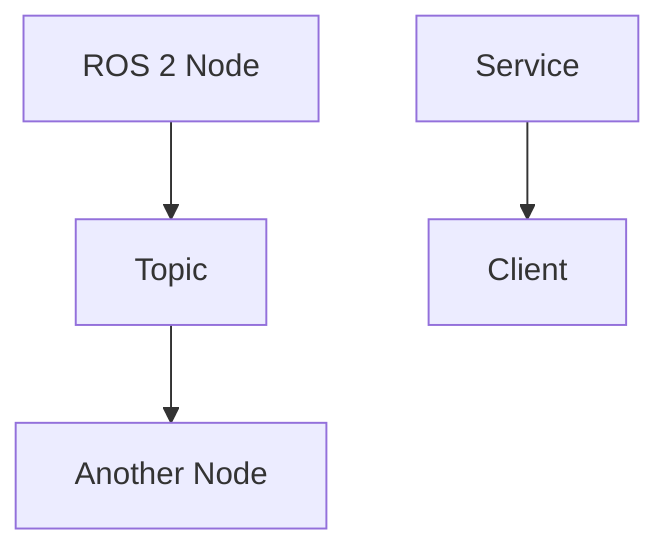

# Quickstart: The Robotic Nervous System (ROS 2)

## Prerequisites

- Node.js version 18 or higher
- npm or yarn package manager
- Git for version control
- Basic understanding of JavaScript and Markdown

## Setup Instructions

### 1. Initialize Docusaurus Project

```bash
# Create a new Docusaurus project
npx create-docusaurus@latest website-name classic

# Or if you're adding to an existing project, navigate to your project directory first
cd your-project-directory
npx create-docusaurus@latest --typescript
```

### 2. Install Dependencies

```bash
# Navigate to your Docusaurus project directory
cd website-name

# Install dependencies
npm install
# or
yarn install
```

### 3. Create the ROS 2 Module Structure

Create the following directory structure in your `docs/` folder:

```bash
mkdir -p docs/ros2-basics
mkdir -p docs/communication-model
mkdir -p docs/robot-structure
```

### 4. Add Module Content

Add the following files for each chapter:

**docs/ros2-basics/index.md:**
```markdown
---
sidebar_position: 1
---

# Introduction to ROS 2 for Humanoid Robotics

This chapter introduces the fundamentals of ROS 2 and why it's important for humanoid robotics.
```

**docs/communication-model/index.md:**
```markdown
---
sidebar_position: 2
---

# ROS 2 Communication Model

This chapter covers nodes, topics, services, and practical rclpy examples.
```

**docs/robot-structure/index.md:**
```markdown
---
sidebar_position: 3
---

# Robot Structure with URDF

This chapter explains URDF for humanoid robots and Python-ROS integration.
```

### 5. Configure Sidebar Navigation

Update your `sidebars.js` file to include the new module:

```javascript
// sidebars.js
module.exports = {
  tutorialSidebar: [
    'intro',
    {
      type: 'category',
      label: 'The Robotic Nervous System (ROS 2)',
      items: [
        'ros2-basics/index',
        'ros2-basics/dds-concepts',
        'ros2-basics/why-ros2-for-humanoids',
        'communication-model/index',
        'communication-model/nodes-topics-services',
        'communication-model/rclpy-examples',
        'robot-structure/index',
        'robot-structure/urdf-basics',
        'robot-structure/python-ros-integration',
      ],
    },
  ],
};
```

### 6. Run Development Server

```bash
# Start the development server
npm run start
# or
yarn start

# The site will be available at http://localhost:3000
```

### 7. Build for Production

```bash
# Build the static files for production
npm run build
# or
yarn build
```

## Customization Options

### Adding Code Examples

Docusaurus supports syntax highlighting for many languages including Python:

```markdown
import { useState } from 'react';

function Example() {
  const [count, setCount] = useState(0);

  return (
    <div>
      <p>You clicked {count} times</p>
      <button onClick={() => setCount(count + 1)}>
        Click me
      </button>
    </div>
  );
}
```

### Adding Diagrams

You can include diagrams using mermaid syntax:

```markdown


## Deployment

### GitHub Pages Deployment

1. Update your `docusaurus.config.js` with your GitHub repository details:

```javascript
module.exports = {
  // ...
  organizationName: 'your-username', // GitHub username/organization
  projectName: 'your-repo-name', // GitHub repository name
  deploymentBranch: 'gh-pages', // Branch to deploy to
  // ...
};
```

2. Build and deploy:

```bash
# Deploy to GitHub Pages
npm run deploy
```

## Troubleshooting

### Common Issues

1. **Port already in use**: If port 3000 is already in use, Docusaurus will automatically try the next available port.

2. **Dependency conflicts**: If you encounter dependency conflicts, try clearing the cache:
   ```bash
   rm -rf node_modules package-lock.json
   npm install
   ```

3. **Build errors**: Check that all Markdown files have proper frontmatter and syntax.